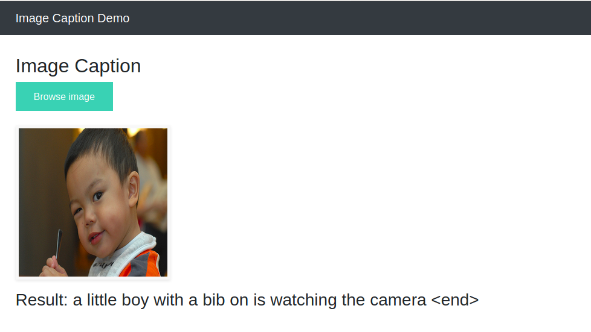
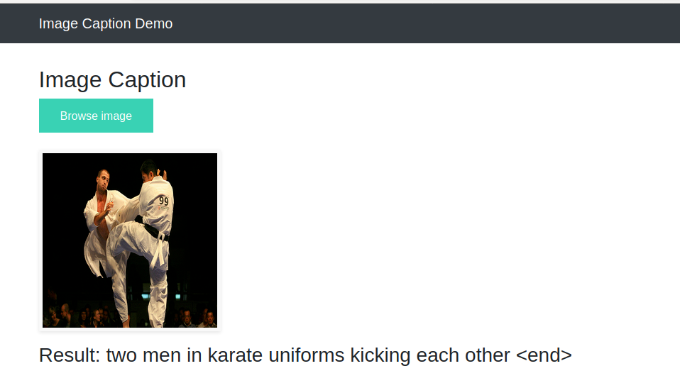
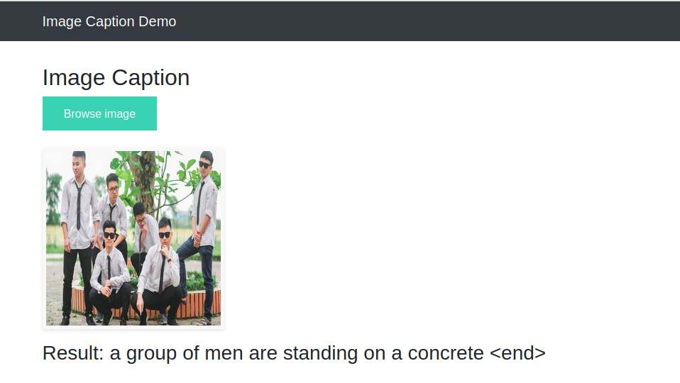
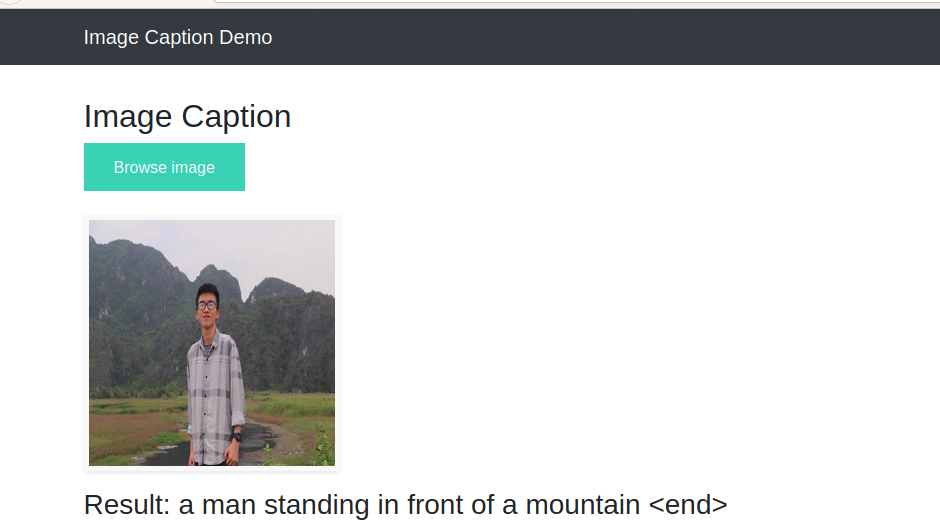

# Image-Captioning
My tensorflow implement of Show Attend & Tell paper: https://arxiv.org/abs/1502.03044

## Data 
Loading flickr8k datasets from https://academictorrents.com/details/9dea07ba660a722ae1008c4c8afdd303b6f6e53b  into folder : /content/drive/My Drive/datasets/ 
```
Structure:
├─ data.py                               % data_loader 
├─ models.py                             % all structure model in here 
├─ preprocessing.py                      % preprocessing for npy file
├─ train.py                              % train file
└─ utils.py                              % additional function
├─ captions.py                           % test file, design to app
├─ app.py                                % demo file, run by flask
├─ static                                %  
├─ templates                             % web front end
└─ content/drive/My Drive/datasets       % store data, result, checkpoint in here   
    └─Flickr8k
        └─ Flickr8k_Dataset
            └─ FLicker8k_Dataset
            └─ FLicker8k_nunpy
            └─ FLicker8k_stats
        ...
    └─ modelcheckpoint
        └─ train
                    
```

## Preprocessing
Run command to save image npy and embedding matrix
```
python preprocessing.py
```
## Training
Train by yourself
```
python train.py
```
## Demo
I made demo by flask, so you can try to use
```
python app.py
```
Here some good results.


##### (1) A little boy with a bib on is watching the camera


##### (2) Two men in karate uniforms kicking each other


##### (3) A group of men are standing on a concrete


##### (4) A man standing in front of a mountain


## Report

[Report]('./static/slide.pdf')


## References
This code inspired by : . https://www.tensorflow.org/tutorials/text/image_captioning
                        . https://github.com/krishnaik06/Deployment-Deep-Learning-Model
                        . https://machinelearningmastery.com/develop-a-deep-learning-caption-generation-model-in-python/
